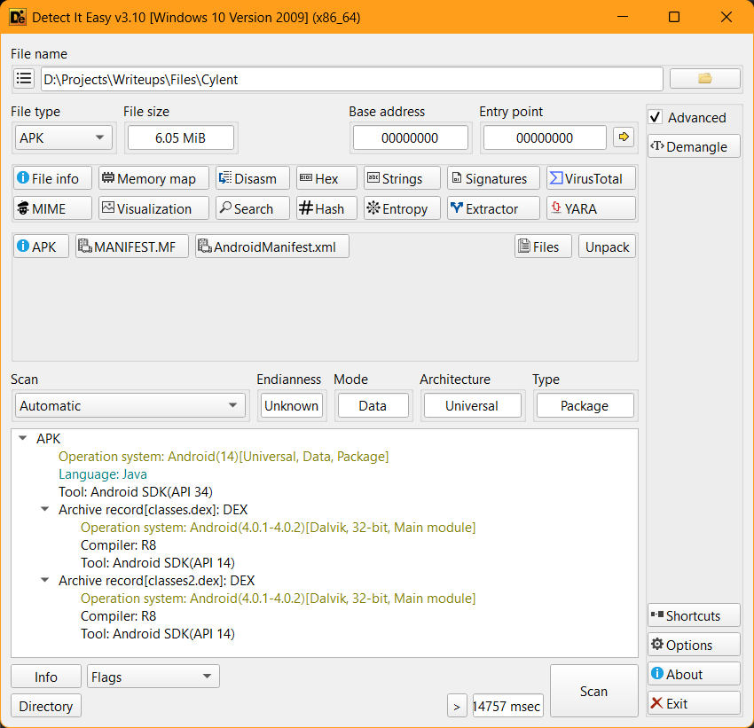
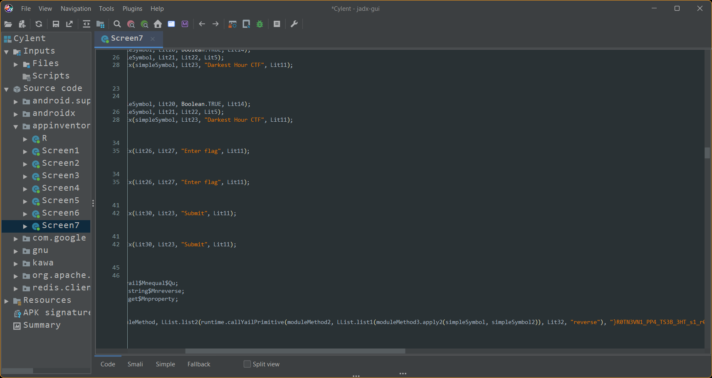

# Cylent Writeup

**Description:**

Explore my new app and let me know if you find anything interesting!

**Attachment:**
[Cylent](../Files/Cylent)

## Solution

This challenge is a friendly introduction to reverse engineering android packages, aka mobile apps. It relies on static analysis and familiarity with [JADX](https://github.com/skylot/jadx).

1. We import the file into [DiE](https://github.com/horsicq/Detect-It-Easy) to learn more about it.

> We can clearly see it's an android package file (APK)

2. We import the file again into JADX and start looking around, soon enough we stumble upon our target:

3. We simply reverse the string using CyberChef and there's our flag:

        Securinets{MIT_App_invent0r_1s_TH3_B3ST_4PP_1NV3NT0R}

***Author: jio***
