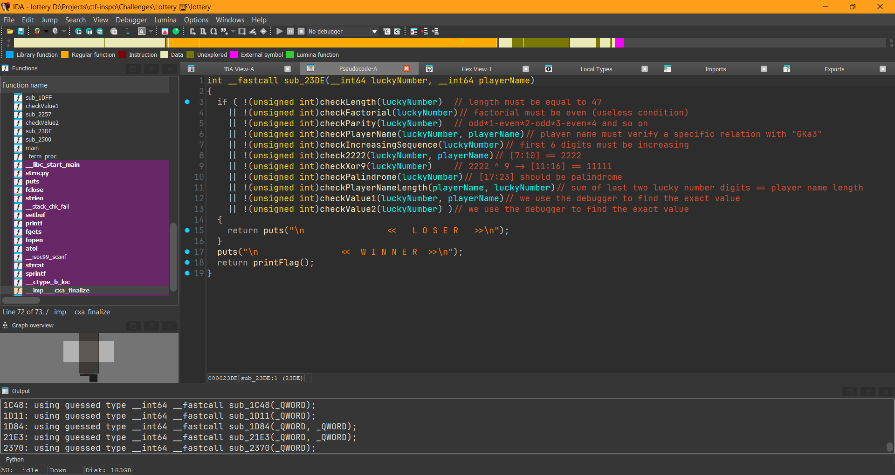
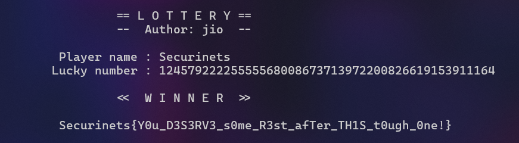

# Lottery Writeup

**Description:**

My player name is **Securinets**, can you find my lucky number?

**Attachment:**
[lottery](../Files/lottery)

## Solution

This is a classic serial key checker challenge that requires a valid username and serial key combination in order to validate all conditions and print out the flag. LLMs such as ChatGPT or DeepSeek might save you a lot of time and effort. You can either solve the challenge manually or use [z3-solver](https://github.com/Z3Prover/z3) or [angr](https://angr.io/).

1. We open the binary in IDA or any other disassembler.
2. We rename a few variables and start static analysis of different checks to determine the necessary conditions:

3. We use GDB or Linux Remote Debugger in IDA to find the missing values and construct a valid lucky number (there is plenty!)

That's all for this CTF, hope you enjoyed the challenges, see you in the next one!

***Author: jio***
