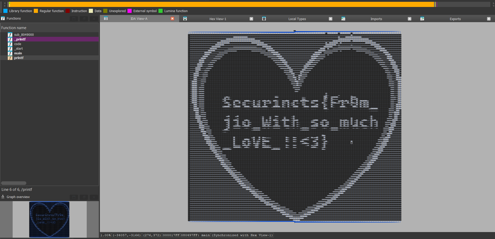

# The Bigger Picture Writeup

**Description:**

Reverse Engineering isn't always about attention to detail. Sometimes, all you have to do is *look at the bigger picture*.

**Attachment:**
[TheBiggerPicture](../Files/TheBiggerPicture)

## Solution

This is a warmup task inspired by [Chris Domas's talk](https://www.youtube.com/watch?v=HlUe0TUHOIc) at DEF CON 23 where he demonstrates how a program’s control flow graph (CFG) in IDA Disassembler can be visualized as an image. You can make your own using his open source [tool](https://github.com/Battelle/REpsych) just like I did.

1. We open the binary in IDA Free or Pro.
2. We increase the `Max number of nodes` limit in IDA settings to something like `100000`:

        Options > General > Graph > Max number of nodes

3. We look at the flow chart:

        View > Graphs > Flow chart

4. There is our flag! 🎉

        Securinets{Fr0m_jio_With_so_much_LoVE_!!<3}

The goal of this challenge is to encourage players and reverse engineers to examine the flow chart, not just the pseudocode. Plus, it's pretty cool ¯\\\_(ツ)\_/¯

***Author: jio***
